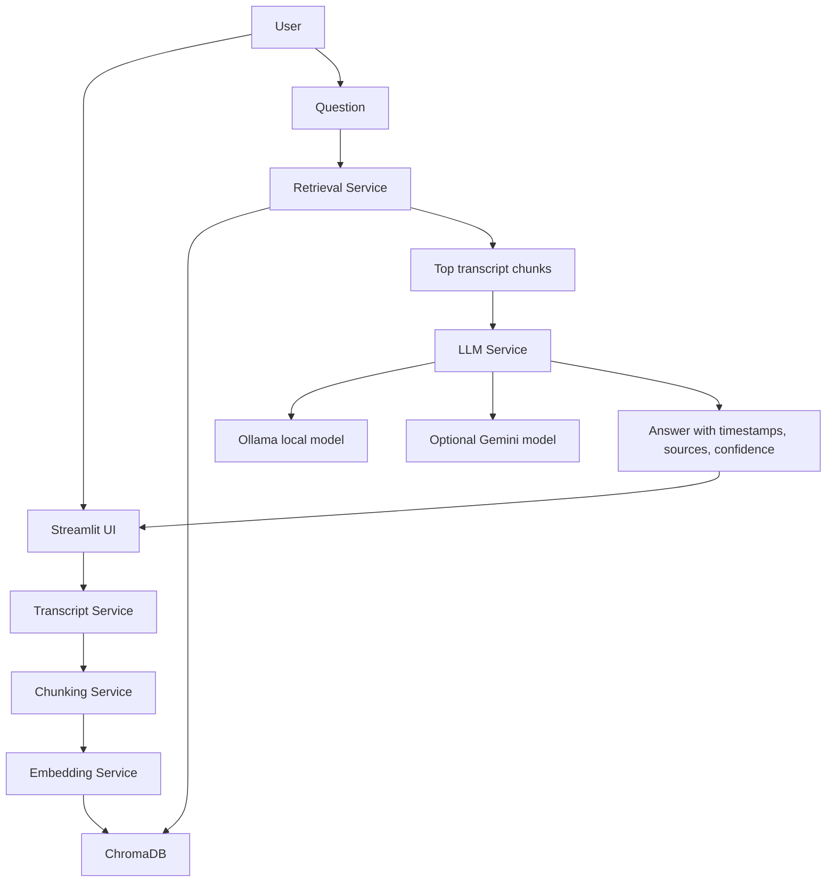

# YouTube Video Chatbot

A free-stack chatbot that answers questions from a YouTube video's transcript. It fetches transcript text, chunks it with timestamps, stores embeddings in ChromaDB, retrieves the most relevant transcript passages, and answers using either a local Ollama model or Gemini.

## Features

- Paste a YouTube URL and process its transcript
- Preserve transcript timestamps
- Chunk transcript text with overlap
- Generate embeddings with `sentence-transformers`
- Store and query vectors with ChromaDB
- Ask transcript-grounded questions
- Show timestamp citations, source chunks, and confidence
- Chat history and clear chat button
- Study helpers: summary, notes, flashcards, and MCQs
- Local free LLM support through Ollama
- Optional Gemini support

## Architecture

The app follows a retrieval-augmented generation flow. The LLM does not answer from its own memory first; it receives only the most relevant transcript chunks and is instructed to answer from that context.

```text
YouTube URL
    |
    v
Transcript Service
    |
    v
Chunking Service
    |
    v
Embedding Service
    |
    v
ChromaDB Vector Store
    |
    v
Retriever
    |
    v
LLM Service: Ollama or Gemini
    |
    v
Answer + timestamps + source chunks
```



## How It Works

### Video Processing Flow

1. The user pastes a YouTube URL in the Streamlit sidebar.
2. `transcript_service.py` extracts the video ID and fetches transcript rows with `text`, `start`, and `duration`.
3. `chunking_service.py` combines transcript rows into overlapping chunks.
4. `embedding_service.py` embeds each chunk with `all-MiniLM-L6-v2`.
5. `vector_store_service.py` stores chunk text, timestamps, and embeddings in ChromaDB.

### Question Answering Flow

1. The user asks a question in the chat interface.
2. `retrieval_service.py` embeds the question and retrieves the top matching transcript chunks from ChromaDB.
3. `gemini_service.py` sends the retrieved chunks to the configured LLM provider.
4. The LLM receives a strict prompt: answer only from transcript context.
5. The UI displays the answer, confidence score, timestamp range, and source chunks.

## Module Responsibilities

| Module | Responsibility |
| --- | --- |
| `ui/streamlit_app.py` | Streamlit interface, chat state, video processing button, study actions |
| `services/transcript_service.py` | YouTube video ID extraction and transcript fetching |
| `services/chunking_service.py` | Timestamp-preserving transcript chunking |
| `services/embedding_service.py` | Sentence-transformer embedding generation |
| `services/vector_store_service.py` | ChromaDB collection creation, storage, and querying |
| `services/retrieval_service.py` | Top-k transcript retrieval with similarity scores |
| `services/gemini_service.py` | LLM provider wrapper for Ollama or Gemini |
| `prompts/qa_system.txt` | Transcript-only answer policy |
| `prompts/study_prompts.py` | Prompt templates for summary, notes, flashcards, and MCQs |

## Key Design Choices

- **Transcript-first answers:** The chatbot is designed for grounded video Q&A, so answers are based on retrieved transcript chunks.
- **Timestamps preserved:** Each chunk stores `start_time` and `end_time`, making answers traceable back to the video.
- **Local LLM by default:** Ollama avoids hosted API quota issues and keeps the project free for demos.
- **Small embedding model:** `all-MiniLM-L6-v2` is fast, free, and works well for semantic transcript search.
- **Persistent vector store:** ChromaDB keeps processed video embeddings locally in `chroma_db`.
- **Minimal backend:** FastAPI is included with a health endpoint, while Streamlit handles the main app experience.

## Project Structure

```text
youtube-chatbot/
├── app.py
├── config.py
├── requirements.txt
├── README.md
├── prompts/
│   ├── qa_system.txt
│   └── study_prompts.py
├── services/
│   ├── transcript_service.py
│   ├── chunking_service.py
│   ├── embedding_service.py
│   ├── vector_store_service.py
│   ├── retrieval_service.py
│   └── gemini_service.py
└── ui/
    └── streamlit_app.py
```

## Requirements

- Python 3.11
- Ollama for local free LLM usage
- A YouTube video with an available transcript

## Setup

```bash
cd youtube-chatbot
python3.11 -m venv .venv
source .venv/bin/activate
pip install -r requirements.txt
cp .env.example .env
```

## Option 1: Run With Free Local Ollama

Ollama is the default LLM provider for this project because it keeps the demo fully free and local. It avoids hosted API quotas, billing setup, rate limits, and model availability issues while still letting the app generate transcript-grounded answers. This is useful for demos, classrooms, and personal study workflows where reliability matters more than using the largest hosted model.

Install Ollama:

```bash
brew install ollama
```

Use the small model already configured by default:

```bash
ollama pull qwen2.5:0.5b
```

For better answers, use a larger free model:

```bash
ollama pull llama3.2:3b
```

Then update `.env`:

```bash
LLM_PROVIDER=ollama
OLLAMA_BASE_URL=http://localhost:11434
OLLAMA_MODEL=llama3.2:3b
```

Start Ollama:

```bash
ollama serve
```

## Experiment With Ollama Models

You can try different local models without changing the app code. Pull a model, update `OLLAMA_MODEL` in `.env`, then restart Streamlit.

List installed models:

```bash
ollama list
```

Pull a new model:

```bash
ollama pull llama3.2:3b
```

Update `.env`:

```bash
OLLAMA_MODEL=llama3.2:3b
```

Restart Streamlit:

```bash
streamlit run ui/streamlit_app.py
```

Suggested free models:

- `qwen2.5:0.5b`: fastest and lightest, good for quick demos on low-memory machines
- `llama3.2:3b`: better answer quality while still running comfortably on many laptops
- `qwen2.5:3b`: strong general-purpose option for transcript Q&A
- `qwen2.5:7b`: higher quality, but needs more RAM and may respond more slowly

If a model feels slow, switch to a smaller one. If answers feel too shallow, try a larger one.

## Option 2: Run With Gemini

If you have free Gemini quota available, update `.env`:

```bash
LLM_PROVIDER=gemini
GOOGLE_API_KEY=your_google_ai_studio_key
GEMINI_MODEL=gemini-2.0-flash-lite
```

## Run The Streamlit App

In a terminal with the virtual environment active:

```bash
streamlit run ui/streamlit_app.py
```

Open the local URL Streamlit prints, usually:

```text
http://localhost:8501
```

## Optional FastAPI Health Check

The FastAPI app currently exposes a simple health endpoint:

```bash
uvicorn app:app --reload
```

Then open:

```text
http://127.0.0.1:8000/health
```

## Environment Variables

```bash
LLM_PROVIDER=ollama
GOOGLE_API_KEY=your_google_ai_studio_key
GEMINI_MODEL=gemini-2.0-flash-lite
OLLAMA_BASE_URL=http://localhost:11434
OLLAMA_MODEL=qwen2.5:0.5b
EMBEDDING_MODEL=all-MiniLM-L6-v2
CHROMA_PERSIST_DIR=chroma_db
CHUNK_SIZE=1000
CHUNK_OVERLAP=200
RETRIEVAL_TOP_K=5
```

## Usage

1. Start Ollama if using local LLM mode.
2. Start Streamlit.
3. Paste a YouTube URL in the sidebar.
4. Click `Process`.
5. Ask questions in the chat box.
6. Review timestamp citations and source chunks.

## Notes

- `.env`, `.venv`, `chroma_db`, caches, and local OS files are ignored by Git.
- The app answers from retrieved transcript chunks only.
- If transcript data is missing for a video, try a different video with captions enabled.
